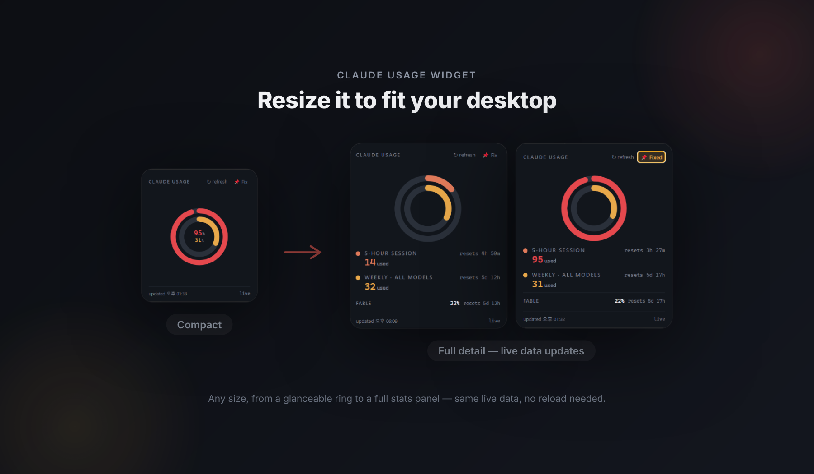

# usage-tracker-for-claude


A featherweight Windows system-tray app that shows your **claude.ai 5-hour session**
and **weekly** usage at a glance — with reset countdowns and limit alerts — so you
never get throttled mid-prompt again.

Left-click the tray icon for a popup with both percentages and live countdowns.
The tray icon itself is a tiny dual-ring gauge that fills as your usage climbs.

> _Unofficial, community-built tool. Not affiliated with, endorsed by, or
> sponsored by Anthropic. "Claude" is a trademark of Anthropic._

---

## 📸 Screenshot



Drag any edge to resize — from a glanceable ring to a full stats panel, same
live data, no reload.

---

## ✨ Features

- **Zero-dependency ring gauges** — the concentric usage rings on the taskbar icon
  are drawn by hand: raw RGBA pixel math wrapped in a from-scratch PNG encoder, no
  canvas or graphics library. It stays tiny and fast.
- **Live reset countdowns** — see exactly when your 5-hour and weekly windows roll over.
- **Native desktop notifications** at 70%, 90%, and 100% — each fires once per
  window on first reach (not every poll), toggleable from the tray menu.
- **Per-model weekly breakdown** — accounts with a per-model cap (e.g. Fable) get an
  extra row per model.
- **Auto-discovers your org** — no config to edit; it finds the right endpoint from
  your logged-in session and keeps working even if you switch accounts.
- **Smart popup** — remembers its position/size, pin it to keep it open, or let it
  snap to the corner and auto-hide.
- **Launch on Windows startup** — one toggle in the tray menu.
- **Reads only your own data, in your own session** — the request runs inside a
  logged-in claude.ai window using your own cookies. Nothing is sent anywhere else.

---

## 🚀 Installation & Setup

### For users (just want to run it)

1. Go to the **[Releases](https://github.com/HubbyLight/usage-tracker-for-claude/releases)** tab.
2. Download the latest `ClaudeUsage.exe` (portable — no installer needed).
3. Run it. On first launch, click **"Sign in to Claude"** and log in once — the
   session persists, and your numbers go live.

> _(No releases yet? See "Publishing a release" below to build and upload the `.exe`.)_

### For developers (run from source)

```bash
git clone https://github.com/HubbyLight/usage-tracker-for-claude.git
cd usage-tracker-for-claude
npm install
npm start
```

It ships with **demo mode off**, so it reads your real usage after you sign in.
(Flip `DEMO_MODE = true` in `main.js` to preview the UI with fake numbers.)

### Configuration — usually none needed

By default there's **nothing to configure**: the app calls `/api/organizations`,
picks your chat-capable org, and reads `/api/organizations/<uuid>/usage`. Because the
org id is discovered at runtime, it keeps working across account switches, and **no
personal id ever lives in the code.**

<details>
<summary><b>Optional:</b> pin a specific organization</summary>

Only needed if your account has more than one org and the auto-pick chooses the
wrong one:

```bash
cp config.example.js config.js      # Windows: copy config.example.js config.js
```

Then set your URL in `config.js` (it's git-ignored, so it never lands in the repo):

```js
module.exports = {
  USAGE_ENDPOINT: 'https://claude.ai/api/organizations/<your-org-uuid>/usage',
};
```

Find `<your-org-uuid>` via claude.ai → Settings → Usage with DevTools open
(F12 → Network → Fetch/XHR → look for the `usage` request's URL).
</details>

---

## 🛠️ Built With

- **[Electron](https://www.electronjs.org/)** — the desktop shell (tray, windows, notifications)
- **[Node.js](https://nodejs.org/)** — runtime
- **[electron-builder](https://www.electron.build/)** — packages the portable `.exe`
- No runtime UI/graphics dependencies — the gauges and tray icon are pure JS + hand-rolled PNG encoding.

---

## 💬 Feedback & Contributing

Found a bug, or want a feature? **[Open an issue](https://github.com/HubbyLight/usage-tracker-for-claude/issues)** —
that's the best way to reach me, and it doesn't require sharing anyone's email.

Pull requests are welcome too. For a bigger change, open an issue first so we can
discuss the direction.

---

## 📦 Publishing a release (maintainer note)

To hand users a ready-to-run `.exe`:

```bash
npm run dist
```

This produces a portable executable in `dist/`. Create a **Release** on GitHub and
attach that file so it appears under the Releases tab.

---

## ⚠️ Caveats

- **Unofficial.** The usage endpoint is internal and undocumented. Anthropic can
  change it at any time, which may break the readout — if that happens the popup
  shows **"check parseUsage"** and `parseUsage()` in `main.js` needs a small tweak.
  Great as a personal tool; don't build a business on it.
- **Reads only your own data.** No password sharing, no scraping other accounts —
  it surfaces the same numbers the claude.ai Usage page already shows you.

---

## 📄 License & Author

Released under the **[MIT License](LICENSE)** — free to use, modify, and share.

Created by **[@HubbyLight](https://github.com/HubbyLight)**. Built with Claude as a
pair-programming assistant; I owned the architecture and security decisions.
