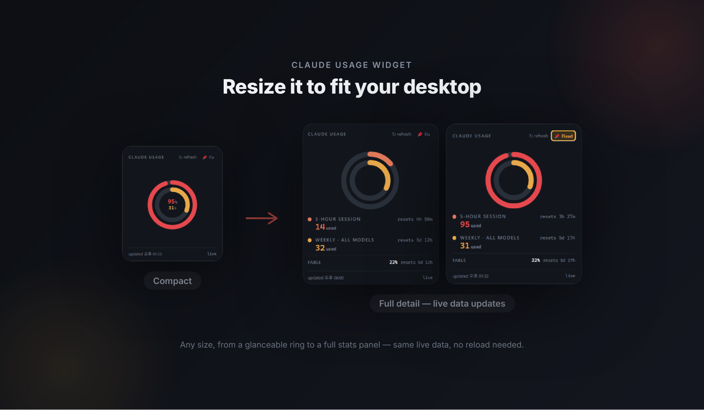

# usage-tracker-for-claude


A featherweight system-tray (Windows) / menu-bar (macOS) app that shows your
**claude.ai 5-hour session** and **weekly** usage at a glance — with reset
countdowns and limit alerts — so you never get throttled mid-prompt again.

Click the tray / menu-bar icon to open a popup with both percentages and live
countdowns; click it again to close it. Right-click for the menu (**Refresh now**,
sign in, launch at login, notifications, quit). The tray icon itself is a tiny dual-ring gauge that fills as your usage climbs.

📓 **[How it was built](docs/ENGINEERING.md)** — design decisions, trade-offs, and
the bugs worth telling. · 📝 **[Changelog](CHANGELOG.md)**

> _Unofficial, community-built tool. Not affiliated with, endorsed by, or
> sponsored by Anthropic. "Claude" is a trademark of Anthropic._

---

## 📸 Screenshot



Drag any edge to resize — from a glanceable ring to a full stats panel, same
live data, no reload.

---

## ✨ Features

- **Zero-dependency ring gauges** — the concentric usage rings on the tray / menu-bar icon
  are drawn by hand: raw RGBA pixel math wrapped in a from-scratch PNG encoder, no
  canvas or graphics library. It stays tiny and fast.
- **Live reset countdowns** — see exactly when your 5-hour and weekly windows roll over.
- **Native desktop notifications** at 70%, 90%, and 100% — each fires once per
  window on first reach (not every poll), toggleable from the tray menu.
- **Per-model weekly breakdown** — accounts with a per-model cap (e.g. Fable) get an
  extra row per model.
- **Auto-discovers your org** — no config to edit; it finds the right endpoint from
  your logged-in session and keeps working even if you switch accounts.
- **Smart popup** — remembers its position/size, pin it to keep it open, or let it
  snap to the corner and auto-hide.
- **Launch at startup** — opt-in toggle in the tray menu (Windows & macOS); off
  until you turn it on.
- **Reads only your own data, in your own session** — the request runs inside a
  logged-in claude.ai window using your own cookies. Nothing is sent anywhere else.

---

## 🚀 Installation & Setup

### For users (just want to run it)

1. Go to the **[Releases](https://github.com/HubbyLight/usage-tracker-for-claude/releases)** tab.
2. Download the latest `Claude.Usage.<version>.exe` (portable — no installer needed).
   Windows SmartScreen may warn because the exe isn't code-signed: **More info →
   Run anyway**.
3. Run it. On first launch, click **"Sign in to Claude"** and log in once — the
   session persists, and your numbers go live.

### Verifying a download

Every release file is built by the public
[GitHub Actions workflow](.github/workflows/build.yml) from the tagged source and
ships with a `.sha256` checksum. To check one:

Download the file **and** its `.sha256` into the same folder, then:

```bash
shasum -a 256 -c Claude.Usage.0.2.7.exe.sha256   # macOS / Linux → "OK"
```

```powershell
Get-FileHash Claude.Usage.0.2.7.exe              # Windows PowerShell
```

On Windows, compare the printed hash with the one inside the `.sha256` file.

### macOS

The same app runs as a **menu-bar** icon on macOS (popup drops from the menu
bar, Dock icon hidden).

> **Heads-up:** these builds aren't notarized by Apple ($99/yr developer
> program), so Gatekeeper will resist them — and on the **latest macOS +
> Apple Silicon** it may hard-block the download entirely, where even the
> workarounds below don't help. If a `.dmg` won't open there, **run from
> source** (below) — that always works. Windows has no such restriction.

- **Download:** grab the `.dmg` from the
  **[Releases](https://github.com/HubbyLight/usage-tracker-for-claude/releases)**
  tab (a public, login-free link — built on GitHub's macOS runners, no Mac of
  your own needed).
- **Build it yourself on a Mac:** `npm install && npm run dist:mac` → `.dmg`
  appears in `dist/`.

**First launch (unsigned app).** The build isn't signed with a paid Apple
Developer certificate, so macOS quarantines it and may say _"…will damage your
computer"_ / _"is damaged and can't be opened."_ That's Gatekeeper blocking an
unsigned download. The app's full source is in this repo, and the Releases are
built from it by GitHub Actions (see _Verifying a download_ above).

> **Copy the commands below from this page** (not from a chat app — messengers
> silently turn `"` and `-` into look-alike characters that break the command).

1. Drag **Claude Usage.app** into your **Applications** folder.
2. Open **Terminal** (Spotlight `⌘Space` → type `Terminal`), paste these two
   lines, and press Return after each:
   ```bash
   xattr -cr "/Applications/Claude Usage.app"
   codesign --force --deep --sign - "/Applications/Claude Usage.app"
   ```
   The first clears the download-quarantine flag; the second re-signs the app
   locally so Apple Silicon will run it. (If macOS offers to install the Command
   Line Developer Tools, accept — it's a one-time system component.)
3. Open the app normally. You only do this once per download.

**Updating.** Right-click the menu-bar icon → **Quit**, drag the new
**Claude Usage.app** from the new `.dmg` over the old one in Applications, and
run the two Terminal lines above again (each new download is quarantined
afresh). After that the `.dmg` itself can be deleted — the app lives in
Applications; the `.dmg` is only the box it ships in.

Still blocked, or prefer no Terminal? **Run it from source instead** (next
section) — that path has no Gatekeeper step at all.

### Run from source (no Gatekeeper hassle)

Needs [Node.js](https://nodejs.org) 22 or newer (the current LTS is fine). In
**Terminal**, run these in order:

```bash
git clone https://github.com/HubbyLight/usage-tracker-for-claude.git
cd usage-tracker-for-claude
npm install
npm start
```

The first `npm start` downloads the Electron runtime, so it takes a moment.

**Getting _"Electron will damage your computer"_ / a `SIGKILL` on macOS?**
Clear the quarantine flag and re-sign the Electron binary locally (copy from
this page so the `-` isn't mangled), then `npm start` again:

```bash
sudo xattr -rd com.apple.quarantine -r node_modules/electron/dist/Electron.app
codesign --force --deep --sign - node_modules/electron/dist/Electron.app
```

It ships with **demo mode off**, so it reads your real usage after you sign in.
(Flip `DEMO_MODE = true` in `main.js` to preview the UI with fake numbers.)

### Configuration — usually none needed

By default there's **nothing to configure**: the app calls `/api/organizations`,
picks your chat-capable org, and reads `/api/organizations/<uuid>/usage`. Because the
org id is discovered at runtime, it keeps working across account switches, and **no
personal id ever lives in the code.**

<details>
<summary><b>Optional:</b> pin a specific organization</summary>

Only needed if your account has more than one org and the auto-pick chooses the
wrong one:

```bash
cp config.example.js config.js      # Windows: copy config.example.js config.js
```

Then set your URL in `config.js` (it's git-ignored, so it never lands in the repo):

```js
module.exports = {
  USAGE_ENDPOINT: 'https://claude.ai/api/organizations/<your-org-uuid>/usage',
};
```

Find `<your-org-uuid>` via claude.ai → Settings → Usage with DevTools open
(F12 on Windows / ⌥⌘I on macOS → Network → Fetch/XHR → look for the `usage`
request's URL).
</details>

---

## 🛠️ Built With

- **[Electron](https://www.electronjs.org/)** — the desktop shell (tray, windows, notifications)
- **[Node.js](https://nodejs.org/)** — runtime
- **[electron-builder](https://www.electron.build/)** — packages the portable `.exe` and the macOS `.dmg` / `.zip`
- No runtime UI/graphics dependencies — the gauges and tray icon are pure JS + hand-rolled PNG encoding.

---

## 💬 Feedback & Contributing

Found a bug, or want a feature? **[Open an issue](https://github.com/HubbyLight/usage-tracker-for-claude/issues)** —
that's the best way to reach me, and it doesn't require sharing anyone's email.

Pull requests are welcome too. For a bigger change, open an issue first so we can
discuss the direction.

---

## 📦 Publishing a release (maintainer note)

Releases are built and published by
[GitHub Actions](.github/workflows/build.yml) — no local build needed:

1. Bump `version` in `package.json` (and `package-lock.json`), the README
   badge, and add an entry to [CHANGELOG.md](CHANGELOG.md).
2. Commit and push to `main`.
3. Tag and push the tag:
   ```bash
   git tag v0.2.7 && git push origin v0.2.7
   ```

The workflow builds Windows and macOS in parallel and attaches the `.exe`,
`.dmg`, `.zip` and a `.sha256` for each to a new public Release.
(`npm run dist` / `npm run dist:mac` still work for a local build into `dist/`.)

---

## 🔒 Privacy & security

- **Network:** the app only talks to `claude.ai` — the sign-in page you log in to,
  plus `GET /api/organizations` and `GET /api/organizations/<uuid>/usage`. There
  is no telemetry, analytics, or other server.
- **Your session stays local:** the claude.ai login lives in Electron's own
  profile on your machine (`persist:claude` partition). The app never reads,
  exports, or uploads your cookies — requests run inside that window, so the
  browser attaches them as it would on claude.ai. Links you click in that
  window open in your default browser, not inside the logged-in session.
- **Encrypted at rest:** that login cookie is encrypted on disk with a key
  kept in the OS keychain (macOS) / DPAPI (Windows), the same way Chrome does
  it. On macOS you may be asked once per update to let **Claude Usage** use
  its "Safe Storage" keychain item: choose **Always Allow** (choosing Deny just
  signs you out).
- **Locked-down runtime:** release builds can't be started as a plain Node.js
  runtime (`ELECTRON_RUN_AS_NODE`), ignore `NODE_OPTIONS` and `--inspect`, and
  only load the app code packed inside them.
- **On disk:** only `settings.json` (notification toggle) and
  `popup-bounds.json` (window position), next to the claude.ai login session, in
  the app's user-data folder — `%APPDATA%\claude-usage-tracker` on Windows,
  `~/Library/Application Support/claude-usage-tracker` on macOS. Delete that
  folder to sign out and reset everything.
- **No auto-start without asking:** launch-at-login is off until you enable it
  from the tray menu.
- **Antivirus warnings:** unsigned Electron apps are sometimes flagged by
  heuristic scanners. If yours flags a release file, check its hash (above) and
  please [open an issue](https://github.com/HubbyLight/usage-tracker-for-claude/issues).

---

## ⚠️ Caveats

- **Unofficial.** The usage endpoint is internal and undocumented. Anthropic can
  change it at any time, which may break the readout — if that happens the popup
  shows **"check parseUsage"** and `parseUsage()` in `main.js` needs a small tweak.
  Great as a personal tool; don't build a business on it.
- **Reads only your own data.** No password sharing, no scraping other accounts —
  it surfaces the same numbers the claude.ai Usage page already shows you.

---

## 📄 License & Author

Released under the **[MIT License](LICENSE)** — free to use, modify, and share.

Created by **[@HubbyLight](https://github.com/HubbyLight)** · maintained since July 2026.
Built with Claude as a pair-programming assistant; I owned the architecture and
security decisions.
